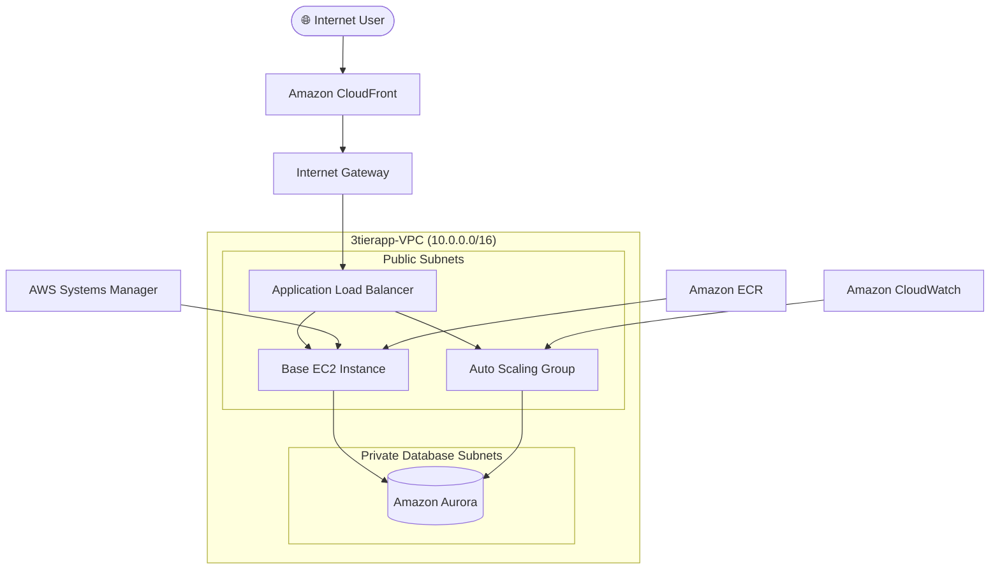

# 🚀 3-Tier Web Application Architecture on AWS

A **production-grade, highly available, and containerized 3-tier web application architecture** deployed on **Amazon Web Services (AWS)**.

This project demonstrates modern **Cloud Engineering** and **DevOps** design patterns including:

- 🚀 Zero-touch CI/CD deployments
- 🔄 Auto-healing compute fleets
- 🔐 Zero-Trust network security
- 🌍 Global edge acceleration using Amazon CloudFront
- 📊 Centralized monitoring and observability
- 🐳 Containerized application deployment
- ⚖️ High availability with Auto Scaling & Load Balancing

---

# 📑 Table of Contents

1. [📋 Prerequisites & Estimated Costs](#-prerequisites--estimated-costs)
2. [🎯 Project Overview](#-project-overview)
3. [🏗️ Architecture Diagram](#️-architecture-diagram)
4. [🌐 Core Infrastructure Setup](#-core-infrastructure-setup)
5. [🔐 IAM Roles & Security Configuration](#-iam-roles--security-configuration)
6. [💻 EC2 Deployment & Automation](#-ec2-instance-configuration--deployment-automation)
7. [📦 Amazon ECR Setup](#-amazon-ecr-setup)
8. [⚙️ AWS Systems Manager (SSM)](#️-aws-systems-manager-ssm)
9. [🗄️ Amazon Aurora Database](#️-amazon-aurora-database-setup)
10. [🌍 CloudFront & Route 53](#-content-delivery-network-cdn--dns-configuration)
11. [⚖️ Auto Scaling & Load Balancer](#️-auto-scaling--load-balancing)
12. [📊 Monitoring & Observability](#-monitoring--observability)
13. [🛠️ Troubleshooting Guide](#️-troubleshooting-guide)

---

# 📋 Prerequisites & Estimated Costs

## 🔧 Required Tools

- AWS CLI v2.x
- Docker v24+
- Docker Compose v2+
- Git
- Node.js v18+
- npm v9+

---

## 🔐 Required AWS IAM Permissions

The deployment user should have permissions for:

```text
ec2:*
rds:*
cloudfront:*
route53:*
iam:*
ssm:*
ecr:*
cloudwatch:*
autoscaling:*
```

---

## 💰 Estimated Monthly AWS Cost (ap-south-1)

| AWS Service | Configuration | Estimated Cost |
|-------------|--------------|---------------:|
| EC2 Base Instance | 1 × t3.medium | ~$30 |
| Auto Scaling Group | 1–4 × t3.micro | ~$8.50–34 |
| Amazon Aurora | Multi-AZ | ~$45–120 |
| Application Load Balancer | 1 ALB | ~$22 |
| Amazon CloudFront | <10GB Transfer | Free Tier / <$1 |
| AWS Systems Manager | Fleet Manager | Free |
| **Total** | Standard Environment | **~$105–187/month** |

---

# 🎯 Project Overview

The primary objective of this project is to implement a **highly available**, **fault-tolerant**, and **secure** enterprise-grade application delivery platform on AWS.

The architecture follows a **3-tier design pattern**, separating the application into:

- 🌐 Presentation Tier
- ⚙️ Application Tier
- 🗄️ Database Tier

This separation improves:

- Scalability
- Security
- Maintainability
- Fault Isolation
- Operational Reliability

---

## 🏛 Architecture Overview

```
            Client Browser
                  │
                  ▼
      Amazon CloudFront (CDN)
        Edge Caching + SSL
                  │
                  ▼
    Application Load Balancer
        Public Subnets
          Ports 80 / 443
                  │
      ┌───────────┴───────────┐
      ▼                       ▼

  Web/App Node 1        Web/App Node 2
 React + Nginx          Node.js Backend
 Ports:80/4000          Ports:80/4000

            │
            ▼

 Amazon Aurora MySQL Cluster
 Private Database Subnets
 Port 3306
```

---

# 🏗️ Key Architectural Pillars

## 🌐 Presentation Tier

- React Frontend
- Nginx Reverse Proxy
- Static Asset Hosting
- API Reverse Proxy

---

## ⚙️ Application Tier

- Node.js
- Express.js
- Business Logic Layer
- REST API

Runs on:

- Docker Containers
- Amazon EC2
- Auto Scaling Group

---

## 🗄️ Data Tier

Amazon Aurora MySQL

Features:

- Multi-AZ Deployment
- Private Subnets
- Automatic Failover
- High Availability
- Read Replica Support

---

## 🔐 Zero Trust Security

The database never accepts traffic from the internet.

Traffic Flow:

```
Internet
     │
     ▼

Load Balancer

     │
     ▼

Application Servers

     │
     ▼

Aurora Database
```

Database Security Groups allow **ONLY** the Application Security Group.

---

## 🚀 Zero-Downtime Deployments

Deployments are performed using:

- AWS Systems Manager
- Amazon ECR
- Docker Compose

No SSH keys are required.

---

# 🏗️ Architecture Diagram



---

# 🌐 Core Infrastructure Setup

The entire infrastructure resides inside a dedicated VPC.

```
3tierapp-VPC
CIDR:
10.0.0.0/16
```

Availability Zones:

- ap-south-1a
- ap-south-1b
- ap-south-1c

---

## VPC Layout

```text
3tierapp-VPC
│
├── Public Subnet (10.0.1.0/24)
│      Web Tier
│
├── Public Subnet (10.0.2.0/24)
│      Auto Scaling
│
├── Private DB Subnet (10.0.3.0/24)
│
└── Private DB Subnet (10.0.4.0/24)
```

---

## Subnet Architecture

| Subnet | AZ | Type | CIDR | Purpose |
|---------|----|------|------|---------|
| AppTier-public | ap-south-1a | Public | 10.0.1.0/24 | Web Tier |
| AppTier-public-2 | ap-south-1b | Public | 10.0.2.0/24 | Auto Scaling |
| DbTier-private1 | ap-south-1a | Private | 10.0.3.0/24 | Aurora Writer |
| DbTier-private2 | ap-south-1c | Private | 10.0.4.0/24 | Aurora Replica |

---

## Security Group Matrix

### 🌍 Load Balancer Security Group

Inbound

- HTTP (80)
- HTTPS (443)

Source:

```
0.0.0.0/0
```

Outbound

```
All Traffic
```

---

### ⚙️ Application Security Group

Inbound

- HTTP (80)
- TCP (4000)
- SSH (22) *(Optional)*

Source

```
Application Load Balancer
```

Outbound

```
All Traffic
```

---

###  Database Security Group

Inbound

```
MySQL 3306
```

Allowed Source

```
Application Security Group ONLY
```

Outbound

```
None
```

---

## Route Tables

### Public Route Table

```
Destination

0.0.0.0/0

↓

Internet Gateway
```

Associated With

- AppTier-public
- AppTier-public-2

---

### Private Route Table

```
10.0.0.0/16

↓

Local
```

Associated With

- DbTier-private1
- DbTier-private2

No Internet Gateway attached.

---

# 🔐 IAM Roles & Security Configuration

The entire infrastructure follows the **Principle of Least Privilege (PoLP)** by granting only the permissions required for each AWS service.

Instead of storing long-lived AWS access keys on EC2 instances, the application uses an **IAM Instance Profile** attached directly to the EC2 instances.

This allows secure access to:

- Amazon ECR
- AWS Systems Manager (SSM)
- Amazon CloudWatch

without exposing credentials on disk.

---

## 🛡️ EC2 Execution Role

**Role Name**

```text
3Tier-EC2-Execution-Role
```

### Purpose

The EC2 execution role enables application instances to:

- Pull Docker images from Amazon ECR
- Register with AWS Systems Manager
- Publish logs and metrics to Amazon CloudWatch

---

## IAM Policy

```json
{
  "Version": "2012-10-17",
  "Statement": [
    {
      "Effect": "Allow",
      "Action": [
        "ecr:GetAuthorizationToken",
        "ecr:BatchCheckLayerAvailability",
        "ecr:GetDownloadUrlForLayer",
        "ecr:BatchGetImage"
      ],
      "Resource": "*"
    },
    {
      "Effect": "Allow",
      "Action": [
        "ssm:DescribeAssociation",
        "ssm:GetDeployablePatchSnapshotForInstance",
        "ssm:GetDocument",
        "ssm:DescribeDocument",
        "ssm:GetParameters",
        "ssm:ListAssociations",
        "ssm:ListInstanceAssociations",
        "ssm:Messages",
        "ssmmessages:*"
      ],
      "Resource": "*"
    },
    {
      "Effect": "Allow",
      "Action": [
        "cloudwatch:PutMetricData",
        "logs:CreateLogGroup",
        "logs:CreateLogStream",
        "logs:PutLogEvents"
      ],
      "Resource": "*"
    }
  ]
}
```

---

## AWS Managed Policies Attached

- `AmazonSSMManagedInstanceCore`
- `AmazonEC2ContainerRegistryReadOnly`

---

# 💻 EC2 Instance Configuration & Deployment Automation

The application runs on a hardened Ubuntu Server with Docker installed.

## Base Instance Specifications

| Component | Configuration |
|-----------|---------------|
| Operating System | Ubuntu Server 22.04 LTS |
| Architecture | x86_64 |
| Base Instance | t3.medium |
| Auto Scaling Instances | t3.micro |
| IAM Role | 3Tier-EC2-Execution-Role |

---

## Deployment Strategy

Instead of manually connecting via SSH and updating containers, deployments are completely automated.

Deployment Flow:

```
GitHub

↓

CI/CD Pipeline

↓

Amazon ECR

↓

AWS Systems Manager

↓

deploy.sh

↓

Docker Compose

↓

Running Containers
```

This enables **zero-touch deployments**, reducing operational overhead and improving deployment consistency.

---

# ⚙️ Deployment Automation Script (`deploy.sh`)

The deployment script resides on the EC2 instance and is executed remotely through **AWS Systems Manager Run Command** during the CI/CD pipeline.

```bash
#!/bin/bash

set -e

# Load environment variables
if [ -f .env ]; then
    export $(cat .env | xargs)
fi

echo "Authenticating Docker with Amazon ECR..."

aws ecr get-login-password \
--region ${AWS_REGION} \
| docker login \
--username AWS \
--password-stdin \
${AWS_ACCOUNT_ID}.dkr.ecr.${AWS_REGION}.amazonaws.com

echo "Pulling latest Docker images..."

docker pull ${AWS_ACCOUNT_ID}.dkr.ecr.${AWS_REGION}.amazonaws.com/web-tier-repo:latest

docker pull ${AWS_ACCOUNT_ID}.dkr.ecr.${AWS_REGION}.amazonaws.com/app-tier-repo:latest

echo "Restarting application..."

docker-compose down --remove-orphans

docker-compose up -d

echo "Removing unused Docker images..."

docker image prune -f

echo "Deployment completed successfully."
```

---

## Deployment Workflow

The deployment script performs the following tasks:

1. Loads environment variables.
2. Authenticates Docker with Amazon ECR.
3. Pulls the latest application images.
4. Stops the running containers.
5. Deploys updated containers.
6. Removes unused Docker images.
7. Completes deployment without downtime.

---

# 🐳 Container Orchestration (`docker-compose.yml`)

Application services are orchestrated using Docker Compose.

```yaml
version: "3.8"

services:

  web-tier:
    image: ${AWS_ACCOUNT_ID}.dkr.ecr.${AWS_REGION}.amazonaws.com/web-tier-repo:latest

    container_name: web-tier

    ports:
      - "80:80"

    restart: always

    depends_on:
      - app-tier

    networks:
      - app-network

  app-tier:
    image: ${AWS_ACCOUNT_ID}.dkr.ecr.${AWS_REGION}.amazonaws.com/app-tier-repo:latest

    container_name: app-tier

    ports:
      - "4000:4000"

    restart: always

    environment:
      - DB_HOST=${RDS_ENDPOINT}
      - DB_USER=${DB_USER}
      - DB_PASSWORD=${DB_PASSWORD}
      - DB_NAME=${DB_NAME}

    networks:
      - app-network

networks:

  app-network:
    driver: bridge
```

---

## Container Architecture

```
                 Docker Host

        ┌─────────────────────────┐
        │                         │
        │     web-tier            │
        │     React + Nginx       │
        │         │               │
        │         ▼               │
        │     app-tier            │
        │ Node.js + Express API   │
        │         │               │
        └─────────┼───────────────┘
                  │
                  ▼
         Amazon Aurora MySQL
```

---

# 📦 Amazon Elastic Container Registry (ECR)

Two private repositories are maintained inside Amazon ECR.

| Repository | Purpose |
|------------|---------|
| `web-tier-repo` | React + Nginx container |
| `app-tier-repo` | Node.js backend container |

---

## Docker Build Workflow

```bash
# Build Web Tier

docker build \
-t web-tier-repo \
./application-code/web-tier

# Build Backend

docker build \
-t app-tier-repo \
./application-code/app-tier
```

---

## Tag Images

```bash
docker tag web-tier-repo:latest \
168266173985.dkr.ecr.ap-south-1.amazonaws.com/web-tier-repo:latest

docker tag app-tier-repo:latest \
168266173985.dkr.ecr.ap-south-1.amazonaws.com/app-tier-repo:latest
```

---

## Authenticate Docker with Amazon ECR

```bash
aws ecr get-login-password \
--region ap-south-1 \
| docker login \
--username AWS \
--password-stdin \
168266173985.dkr.ecr.ap-south-1.amazonaws.com
```

---

## Push Images

```bash
docker push \
168266173985.dkr.ecr.ap-south-1.amazonaws.com/web-tier-repo:latest

docker push \
168266173985.dkr.ecr.ap-south-1.amazonaws.com/app-tier-repo:latest
```

---

## ECR Best Practices

### Image Scanning

- Scan on Push enabled
- Vulnerability detection enabled

---

### Image Tags

```
latest
```

Used for continuous deployment.

---

### Lifecycle Policy

Automatically removes:

- Untagged images
- Images older than **14 days**

This minimizes storage costs and keeps the registry clean.

---

## Deployment Pipeline

```
Developer Pushes Code

↓

CI/CD Pipeline

↓

Docker Build

↓

Amazon ECR

↓

AWS Systems Manager

↓

deploy.sh

↓

Docker Compose

↓

Running Containers
```

---

# ⚙️ AWS Systems Manager (SSM)

To enforce a **Zero-Trust management model**, SSH access (`Port 22`) is disabled on all application instances. Administrative access is performed securely through **AWS Systems Manager Session Manager**, eliminating the need for SSH key management.

---

## Key Benefits

- 🔒 No SSH keys required
- 🛡️ Secure browser-based shell access
- 📋 Session logging and auditing
- 🚀 Remote command execution
- 🔄 Patch management and automation

---

## SSM Agent

Ubuntu Server 22.04 includes the SSM Agent, which can be verified using:

```bash
sudo systemctl status snap.amazon-ssm-agent.amazon-ssm-agent.service
```

---

## Fleet Registration

After attaching the **AmazonSSMManagedInstanceCore** IAM policy, EC2 instances automatically register with Systems Manager and appear as **Online** in Fleet Manager.

Deployment workflow:

```
EC2 Instance
      │
      ▼
IAM Role Attached
      │
      ▼
SSM Agent Registers
      │
      ▼
Fleet Manager
      │
      ▼
Remote Command Execution
```

---

# 🗄️ Amazon Aurora Database Setup

The database layer is powered by **Amazon Aurora MySQL-Compatible Edition**, providing high availability, automatic failover, and Multi-AZ replication.

---

## Cluster Configuration

| Property | Value |
|----------|-------|
| Engine | Amazon Aurora MySQL 8.0 |
| Cluster Name | `threetierdb-cluster` |
| Deployment | Multi-AZ |
| Writer | ap-south-1a |
| Reader | ap-south-1c |
| Database Class | db.t3.medium / db.r6g.large |
| Public Access | Disabled |

---

## Database Security

The Aurora cluster resides entirely inside **private subnets**.

```
Internet
     ❌

Application Server
      │
      ▼

Amazon Aurora
```

Only the **Application Security Group** is allowed to communicate with the database over **TCP 3306**.

---

## Database Connectivity

Application containers receive database credentials through environment variables.

```javascript
module.exports = {
    host: process.env.DB_HOST,
    user: process.env.DB_USER,
    password: process.env.DB_PASSWORD,
    database: process.env.DB_NAME,
    port: 3306
};
```

This avoids hardcoding credentials into the application.

---

# 🌍 Content Delivery Network (CDN) & DNS Configuration

To reduce latency and improve global performance, the application uses **Amazon CloudFront** as a Content Delivery Network.

---

## CloudFront Configuration

### Origin

```
Application Load Balancer
```

Example:

```
3tier-alb-12345.ap-south-1.elb.amazonaws.com
```

---

## Cache Behavior

### Default Route (`*`)

- Cache GET requests
- Cache HEAD requests
- Forward required headers

---

### API Route (`/api/*`)

Caching Disabled

```
TTL = 0
```

Allowed Methods

- GET
- POST
- PUT
- DELETE
- OPTIONS

Query strings and cookies are forwarded to ensure dynamic API behavior.

---

## Viewer Protocol Policy

```
HTTP

↓

Redirect

↓

HTTPS
```

All users are automatically redirected to HTTPS.

---

# 🌐 Amazon Route 53

DNS is managed through Amazon Route 53.

Configuration includes:

- Public Hosted Zone
- Alias Record
- ACM SSL Validation
- CloudFront Integration

DNS Flow

```
Custom Domain

↓

Route53

↓

CloudFront

↓

Application Load Balancer

↓

EC2 Instances
```

---

# ⚖️ Auto Scaling & Load Balancing

The application automatically adjusts compute capacity using an **Application Load Balancer** and an **Auto Scaling Group**.

---

## Application Load Balancer

### Listeners

| Port | Purpose |
|------|---------|
| 80 | HTTP |
| 443 | HTTPS |

---

### Target Group

```
3tier-app-tg
```

Health Check

```
/

or

/health
```

Health Check Interval

```
30 Seconds
```

Healthy Threshold

```
2 Successful Checks
```

---

# 🚀 Launch Template

Auto Scaling instances are launched using a reusable Launch Template.

Configuration:

- Ubuntu Server
- Docker Installed
- IAM Role Attached
- User Data Script
- Detailed Monitoring Enabled

---

# 📈 Auto Scaling Group

Configuration

| Property | Value |
|----------|-------|
| Minimum Capacity | 1 |
| Desired Capacity | 1 |
| Maximum Capacity | 4 |

Deployment spans multiple Availability Zones for improved fault tolerance.

---

## Scaling Policy

Metric

```
CPUUtilization
```

Scale Out

```
CPU > 70%
```

Action

```
+1 Instance
```

Scale-In Cooldown

```
300 Seconds
```

---

## Scaling Workflow

```
Traffic Spike

↓

Application Load Balancer

↓

Average CPU > 70%

↓

CloudWatch Alarm

↓

Auto Scaling Group

↓

Launch New EC2 Instance

↓

Instance Pulls Latest Docker Images

↓

Automatically Joins Load Balancer
```

---

# 📊 Monitoring & Observability

The platform is monitored using **Amazon CloudWatch**.

---

## CloudWatch Dashboard

Metrics collected include:

### Compute Layer

- CPU Utilization
- Network In
- Network Out
- Disk Usage

---

### Load Balancer

- Request Count
- Response Time
- HTTP 5XX Errors
- Healthy Targets

---

### Database

- Database Connections
- CPU Utilization
- Select Latency
- Insert Latency

---

# 🚨 CloudWatch Alarms

## High CPU Alarm

Triggers when

```
CPU > 70%
```

for

```
1 Minute
```

Action

```
Scale Out
```

---

## Aurora Connection Alarm

Triggers when

```
Database Connections

>

80%
```

Action

```
Send CloudWatch Notification
```

---

# 🛠️ Troubleshooting Guide

## 1. Node.js Container Cannot Connect to Database

### Error

```
ECONNREFUSED 127.0.0.1:3306
```

### Cause

Environment variables were not injected into Docker Compose.

### Solution

Ensure:

- `.env` exists
- Docker Compose references environment variables correctly

---

## 2. Docker Pull Authorization Failed

### Error

```
no basic auth credentials
```

### Cause

Amazon ECR authentication token expired.

### Fix

```bash
aws ecr get-login-password \
--region ap-south-1 \
| docker login \
--username AWS \
--password-stdin <AWS_ACCOUNT_ID>.dkr.ecr.ap-south-1.amazonaws.com
```

---

## 3. AWS Systems Manager

### Error

```
InvalidInstanceId
```

### Cause

The EC2 instance was recreated but the CI/CD pipeline still references the previous instance ID.

### Solution

Update the environment variable:

```
EC2_INSTANCE_ID
```

Ensure the new instance has:

- AmazonSSMManagedInstanceCore IAM Role
- Running SSM Agent

---

## 4. CloudWatch Alarm Stuck

### Error

```
INSUFFICIENT_DATA
```

### Cause

Detailed Monitoring is disabled.

### Solution

Enable:

- EC2 Detailed Monitoring
- Desired Capacity ≥ 1

---

#  Project Highlights

This project demonstrates enterprise-grade AWS architecture including:

-  Three-Tier Cloud Architecture
-  Custom Amazon VPC
-  Dockerized Applications
-  Amazon ECR Image Registry
-  Zero-Touch Deployments
-  AWS Systems Manager Automation
-  Amazon Aurora Multi-AZ Database
-  Amazon CloudFront CDN
-  Application Load Balancer
-  Auto Scaling Groups
-  Amazon CloudWatch Monitoring
-  Zero-Trust Security Architecture

---

#  Technologies Used

## Cloud

- Amazon EC2
- Amazon Aurora
- Amazon CloudFront
- Amazon Route 53
- Amazon ECR
- AWS Systems Manager
- Amazon CloudWatch
- Auto Scaling
- Application Load Balancer
- IAM
- VPC

---

## DevOps

- Docker
- Docker Compose
- Bash
- Git
- GitHub
- AWS CLI

---

## Application Stack

- React
- Nginx
- Node.js
- Express.js
- MySQL

---

#  License

This repository is intended for educational purposes and demonstrates modern AWS cloud architecture and DevOps best practices.

---

> **Designed and engineered as part of an AWS 3-Tier Enterprise Infrastructure Portfolio, showcasing production-inspired cloud architecture, automation, scalability, and security best practices.**
