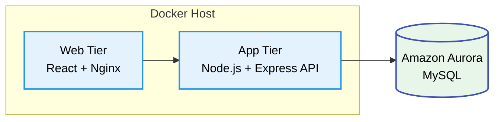
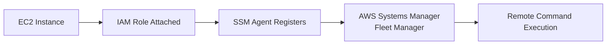
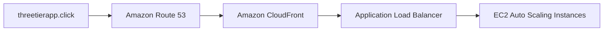
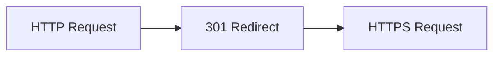
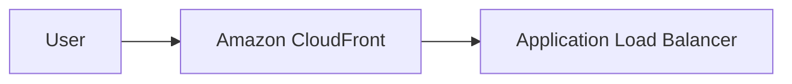
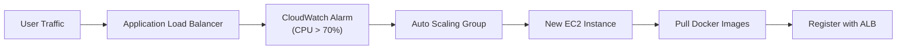

#  3-Tier Web Application Architecture on AWS

A **production-grade, highly available, and containerized 3-tier web application architecture** deployed on **Amazon Web Services (AWS)**.

This project demonstrates modern **Cloud Engineering** and **DevOps** design patterns including:

-  Zero-touch CI/CD deployments
-  Auto-healing compute fleets
-  Zero-Trust network security
-  Global edge acceleration using Amazon CloudFront
-  Centralized monitoring and observability
-  Containerized application deployment
-  High availability with Auto Scaling & Load Balancing


#  Project Overview

The primary objective of this project is to implement a **highly available**, **fault-tolerant**, and **secure** enterprise-grade application delivery platform on AWS using a modern **3-tier architecture**.

| **Tier** | **Components** | **Key Features** |
|----------|----------------|------------------|
|  **Presentation Tier** | React, Nginx | Static asset hosting, Reverse proxy, API routing |
|  **Application Tier** | Node.js, Express.js | Business logic, REST APIs, Docker containers, Amazon EC2, Auto Scaling Group |
|  **Database Tier** | Amazon Aurora MySQL | Multi-AZ deployment, Private subnets, Automatic failover, Read replicas, High availability |

##  Architecture Benefits

| Benefit | Description |
|----------|-------------|
|  **Scalability** | Scale application instances automatically based on demand. |
|  **Security** | Network isolation using Security Groups and private database subnets. |
|  **Maintainability** | Independent deployment and management of each application tier. |
|  **Fault Isolation** | Failures in one tier have minimal impact on the others. |
|  **Operational Reliability** | High availability through Auto Scaling, ALB, and Aurora Multi-AZ. |

<br>

#  Table of Contents

# Table of Contents

1. [ Project Overview](#-project-overview)
2. [Application Stack](#application-stack)
3. [ Prerequisites](#-prerequisites)
4. [Core Infrastructure Setup](#core-infrastructure-setup)
5. [IAM Roles & Security Configuration](#iam-roles--security-configuration)
6. [EC2 Instance Configuration & Deployment Automation](#ec2-instance-configuration--deployment-automation)
7. [Deployment Strategy](#deployment-strategy)
8. [Amazon Elastic Container Registry (ECR)](#amazon-elastic-container-registry-ecr)
9. [AWS Systems Manager (SSM)](#aws-systems-manager-ssm)
10. [Amazon Aurora Database Setup](#amazon-aurora-database-setup)
11. [DNS & Content Delivery Network (CDN) Configuration](#dns--content-delivery-network-cdn-configuration)
12. [Auto Scaling & Load Balancing](#auto-scaling--load-balancing)
13. [Auto Scaling Group (ASG)](#auto-scaling-group-asg)
14. [Monitoring & Observability](#monitoring--observability)
15. [Future Scope](#future-scope)

---

# Application Stack


[](https://aws.amazon.com/)
[](https://aws.amazon.com/ec2/)
[](https://aws.amazon.com/rds/aurora/)
[](https://aws.amazon.com/cloudfront/)
[](https://aws.amazon.com/route53/)
[](https://aws.amazon.com/cloudwatch/)
[](https://aws.amazon.com/systems-manager/)
[](https://aws.amazon.com/iam/)
[](https://aws.amazon.com/vpc/)
[](https://aws.amazon.com/elasticloadbalancing/)
[](https://aws.amazon.com/autoscaling/)
[](https://aws.amazon.com/codepipeline/)
[](https://aws.amazon.com/ecr/)
[](https://github.com/)
[](https://www.gnu.org/software/bash/)
[](https://aws.amazon.com/cli/)
[](https://aws.amazon.com/rds/aurora/)
[](https://www.docker.com/)
[](https://docs.docker.com/compose/)
[](https://nodejs.org/)
[](https://react.dev/)
[](https://nginx.org/)
[](https://www.mysql.com/)
[](https://git-scm.com/)
---

# ⚙️ Prerequisites

Before deploying the architecture, ensure the following tools are installed.

| **Tool** | **Version** | **Purpose** |
|----------|-------------|-------------|
| AWS CLI | v2.x+ | Manage AWS resources |
| Docker | v24.x+ | Container runtime |
| Docker Compose | v2.x+ | Multi-container orchestration |
| Git | Latest | Source code management |
| Node.js | v18.x+ | Local application development |
| npm | v9.x+ | Package management |


## 🚀 Zero-Downtime Deployment

Continuous deployments are performed without SSH access by leveraging AWS native services.

| **Service** | **Role** |
|-------------|----------|
| 🖥️ AWS Systems Manager | Executes deployment commands remotely |
| 📦 Amazon ECR | Stores and distributes Docker images |
| 🐳 Docker Compose | Updates application containers with the latest images |

> **No SSH keys are required.** Deployments are securely executed through **AWS Systems Manager (SSM)**.
<br>

#  Core Infrastructure Setup
###  Key Architectural Pillars


The entire infrastructure resides inside a dedicated VPC.


## VPC Layout & Resource Mapping

The entire VPC topology spans multiple Availability Zones (`ap-south-1a`, `ap-south-1b`, and `ap-south-1c`) with isolated public and private subnets.


* **Public Subnets:** `AppTier-public` (`10.0.1.0/24`) and `Apptier-public-subnet2` (`10.0.2.0/24`) host the web and application compute nodes.
* **Private Subnets:** `DbTier-private1` (`10.0.3.0/24`) and `DbTier-private2` (`10.0.4.0/24`) host the isolated database instances.

---

### Public Subnet Route Table Mapping

Public subnets route outbound internet requests through a custom Route Table (`3tierapp-RT`) attached to the Internet Gateway (`3tierapp-igw`).


---

```
3tierapp-VPC
CIDR:
10.0.0.0/16
```

Availability Zones:

- ap-south-1a
- ap-south-1b

---

## VPC Layout

```text
3tierapp-VPC
│
├── Public Subnet (10.0.1.0/24)
│      Web Tier
│
├── Public Subnet (10.0.2.0/24)
│      Auto Scaling
│
├── Private DB Subnet (10.0.3.0/24)
│
└── Private DB Subnet (10.0.4.0/24)
```

---

## Subnet Architecture

| Subnet | AZ | Type | CIDR | Purpose |
|---------|----|------|------|---------|
| AppTier-public | ap-south-1a | Public | 10.0.1.0/24 | Web Tier |
| AppTier-public-2 | ap-south-1b | Public | 10.0.2.0/24 | Auto Scaling |
| DbTier-private1 | ap-south-1a | Private | 10.0.3.0/24 | Aurora Writer |
| DbTier-private2 | ap-south-1c | Private | 10.0.4.0/24 | Aurora Replica |

<br>

## Security Group Matrix

###   EC2 Instance (Application) Security Group

### Inbound Rules

| Protocol / Port | Purpose | Allowed Source |
|-----------------|---------|----------------|
| **HTTP (80)** | Serves the Nginx/React frontend application | **Application Load Balancer (ALB)** |
| **Custom TCP (4000)** | Handles Node.js backend API requests | **Application Load Balancer (ALB)** |
| **SSH (22)** *(Optional)* | Secure shell access for administration | **Application Load Balancer (ALB)** *(or Admin IP if SSH is enabled)* |

### Outbound Rules

| Protocol | Destination |
|----------|-------------|
| **All Traffic** | `0.0.0.0/0` |

<br>

##  Amazon Aurora Database Security Group

### Inbound Rules

| Protocol / Port | Purpose | Allowed Source |
|-----------------|---------|----------------|
| **MySQL/Aurora (3306)** | Database connections | **EC2 Instance (Application) Security Group ONLY** |

### Outbound Rules

| Protocol | Destination |
|----------|-------------|
| **None** | No outbound traffic allowed (Strictly Isolated) |

### Database Security Group Isolation (`3tier-rds-sg`)

To enforce strict network security, the database security group permits inbound MySQL/Aurora traffic (port `3306`) exclusively from the **Application Security Group ID** (`sg-08f9016c9dcdf3b85`).


<br>

#  IAM Roles & Security Configuration

The entire infrastructure follows the **Principle of Least Privilege (PoLP)** by granting only the permissions required for each AWS service.

Instead of storing long-lived AWS access keys on EC2 instances, the application uses an **IAM Instance Profile** attached directly to the EC2 instances.

This allows secure access to:

- Amazon ECR
- AWS Systems Manager (SSM)
- Amazon CloudWatch

without exposing credentials on disk.


##  EC2 Execution Role

**Role Name**

```text
3Tier-EC2-Execution-Role
```

### Purpose

The EC2 execution role enables application instances to:

- Pull Docker images from Amazon ECR
- Register with AWS Systems Manager
- Publish logs and metrics to Amazon CloudWatch


## 🔐 IAM Policies

The EC2 instance uses an **IAM Instance Profile** that grants only the permissions required for deployment, container management, Systems Manager access, and monitoring. This follows the **Principle of Least Privilege (PoLP)** by limiting access to only the services needed.

###  Amazon ECR Permissions

Allows the EC2 instance to authenticate with Amazon ECR and pull Docker images during deployment.

```json
{
  "Effect": "Allow",
  "Action": [
    "ecr:GetAuthorizationToken",
    "ecr:BatchCheckLayerAvailability",
    "ecr:GetDownloadUrlForLayer",
    "ecr:BatchGetImage"
  ],
  "Resource": "*"
}
```

---

###  AWS Systems Manager (SSM) Permissions

Enables secure remote management of EC2 instances through **AWS Systems Manager**, eliminating the need for SSH access.

```json
{
  "Effect": "Allow",
  "Action": [
    "ssm:DescribeAssociation",
    "ssm:GetDeployablePatchSnapshotForInstance",
    "ssm:GetDocument",
    "ssm:DescribeDocument",
    "ssm:GetParameters",
    "ssm:ListAssociations",
    "ssm:ListInstanceAssociations",
    "ssm:Messages",
    "ssmmessages:*"
  ],
  "Resource": "*"
}
```

---

###  Amazon CloudWatch & Logs Permissions

Allows the instance to publish custom metrics and send application logs to **Amazon CloudWatch** for centralized monitoring and observability.

```json
{
  "Effect": "Allow",
  "Action": [
    "cloudwatch:PutMetricData",
    "logs:CreateLogGroup",
    "logs:CreateLogStream",
    "logs:PutLogEvents"
  ],
  "Resource": "*"
}
```

---

###  AWS Managed Policies

In addition to the custom inline policy, the following AWS managed policies are attached:

| Managed Policy | Purpose |
|---------------|---------|
| **AmazonSSMManagedInstanceCore** | Enables Systems Manager, Session Manager, and Run Command. |
| **AmazonEC2ContainerRegistryReadOnly** | Grants read-only access to pull Docker images from Amazon ECR. |

---

## AWS Managed Policies Attached

- `AmazonSSMManagedInstanceCore`
- `AmazonEC2ContainerRegistryReadOnly`

<br>

#  EC2 Instance Configuration & Deployment Automation

Active compute instances are assigned both private IP addresses within the VPC CIDR block and public IP addresses for external testing.The application runs on a hardened Ubuntu Server with Docker installed.

## Base Instance Specifications

| Component | Configuration |
|-----------|---------------|
| Operating System | Ubuntu Server 22.04 LTS |
| Architecture | x86_64 |
| Base Instance | t3.medium |
| Auto Scaling Instances | t3.micro |
| IAM Role | 3Tier-EC2-Execution-Role |


* **`Apptier` Instance:** `t2.medium` residing in `ap-south-1b` (Public IP: `3.109.153.132`, Private IP: `10.0.4.195`).
* **`Dbtier` Instance:** `t3.micro` residing in `ap-south-1a` (Private IP: `13.127.247.85`).
* **Health Checks:** Passed `2/2` status checks for system and instance reachability.

<br>
# Deployment Strategy

Instead of manually connecting via SSH and updating containers, deployments are completely automated.

## Deployment Pipeline


##  CI/CD Deployment Process Flow

This architecture utilizes a fully automated, Zero-Touch deployment pipeline. Below is the step-by-step lifecycle of a code change from the developer's local machine to the live production environment.

**1. Source Control (Push Code)**
The deployment lifecycle begins when a developer commits and pushes code changes to the **GitHub** repository.

**2. Image Build (AWS CodeBuild)**
**AWS CodePipeline** detects the repository change and automatically triggers **AWS CodeBuild**. CodeBuild pulls the latest source code, runs any necessary tests, and builds fresh Docker images for both the Web-Tier and App-Tier.

**3. Image Registry (Amazon ECR)**
Upon a successful build, CodeBuild securely tags and pushes the newly compiled Docker images into **Amazon Elastic Container Registry (ECR)**.

**4. Deployment Trigger (AWS CodeDeploy & SSM)**
With the images safely stored in ECR, CodePipeline moves to the Deploy stage. **AWS CodeDeploy** invokes **Amazon Systems Manager (SSM)** to securely send a deployment command to the target infrastructure, entirely bypassing the need for open SSH ports.

**5. Script Execution (SSM Agent)**
The **SSM Agent**, running quietly on the target **Amazon EC2** instance within the Public Subnet, receives the deployment instruction and executes the server's local `deploy.sh` script.

**6. Image Retrieval (Docker Compose)**
The `deploy.sh` script triggers the local `docker-compose.yml` file. The EC2 instance securely authenticates with **Amazon ECR** using its IAM Role and pulls down the latest Web-Tier and App-Tier Docker images.

**7. Container Orchestration (Spin Up)**
Docker Compose gracefully tears down the outdated containers and immediately spins up the newly pulled containers. The application is now running the latest code.

**8. Database Connectivity (Amazon Aurora)**
The fresh App-Tier container boots up and securely establishes a connection to the **Amazon Aurora Database** residing in the isolated Private Subnet, ready to serve live, dynamic user traffic.
This enables **zero-touch deployments**, reducing operational overhead and improving deployment consistency.

<br>

##  Deployment Automation Script (`deploy.sh`)

The deployment script resides on the EC2 instance and is executed remotely through **AWS Systems Manager Run Command** during the CI/CD pipeline.

```bash
#!/bin/bash

set -e
# Load environment variables
if [ -f .env ]; then
    export $(cat .env | xargs)
fi

echo "Authenticating Docker with Amazon ECR..."

aws ecr get-login-password \
--region ${AWS_REGION} \
| docker login \
--username AWS \
--password-stdin \
${AWS_ACCOUNT_ID}.dkr.ecr.${AWS_REGION}.amazonaws.com

echo "Pulling latest Docker images..."

docker pull ${AWS_ACCOUNT_ID}.dkr.ecr.${AWS_REGION}.amazonaws.com/web-tier-repo:latest
docker pull ${AWS_ACCOUNT_ID}.dkr.ecr.${AWS_REGION}.amazonaws.com/app-tier-repo:latest

echo "Restarting application..."

docker-compose down --remove-orphans
docker-compose up -d

echo "Removing unused Docker images..."

docker image prune -f

echo "Deployment completed successfully."
```
## `deploy.sh` Workflow

The deployment script performs the following tasks:

1. Loads environment variables.
2. Authenticates Docker with Amazon ECR.
3. Pulls the latest application images.
4. Stops the running containers.
5. Deploys updated containers.
6. Removes unused Docker images.
7. Completes deployment without downtime.

<br>

##  Container Orchestration (`docker-compose.yml`)

Once the CI/CD pipeline triggers the deployment, Docker Compose pulls the latest images from ECR and spins up the isolated application environments.

```yaml
version: "3.8"

services:
  web-tier:
    image: ${AWS_ACCOUNT_ID}.dkr.ecr.${AWS_REGION}.amazonaws.com/web-tier-repo:latest
    container_name: web-tier
    ports:
      - "80:80"
    restart: always
    depends_on:
      - app-tier
    networks:
      - app-network
  app-tier:
    image: ${AWS_ACCOUNT_ID}.dkr.ecr.${AWS_REGION}.amazonaws.com/app-tier-repo:latest
    container_name: app-tier
    ports:
      - "4000:4000"
    restart: always
    environment:
      - DB_HOST=${RDS_ENDPOINT}
      - DB_USER=${DB_USER}
      - DB_PASSWORD=${DB_PASSWORD}
      - DB_NAME=${DB_NAME}
    networks:
      - app-network
networks:
  app-network:
    driver: bridge
```


**Command Line Verification:**
* **Container Status (`docker ps -a`):** Confirms both the `web-tier` (React/Nginx) and `app-tier` (Node.js) containers are actively running and mapped to their respective ports (80 and 4000).
* **Load Balancer Health Checks:** The Nginx container logs actively demonstrate the Application Load Balancer (ELB) pinging the web server and receiving continuous `HTTP/1.1 200 OK` health check responses.

---

## End-to-End Application Data Flow

To verify the Zero-Trust network architecture and database integration, live transactions were processed through the frontend. 


**Verification Flow:**
1. **Presentation Tier:** The React UI successfully loads and accepts user input for database entry.
2. **Application Tier:** The containerized Node.js backend receives the API payload and executes the SQL query. The terminal logs actively display the callback functions processing the newly added transactions (e.g., `jam`, `butter`, `bread`).
3. **Database Tier:** Data is securely written to and retrieved from the isolated Amazon Aurora MySQL database, proving full 3-tier connectivity without public database exposure.

## Container Architecture



<br>

#  Amazon Elastic Container Registry (ECR)

Amazon ECR serves as the secure, private container registry for the 3-tier architecture. It stores version-controlled Docker container images compiled by **AWS CodeBuild** during the CI/CD pipeline and distributes them to the application compute nodes.


### Repository Architecture
| Repository Name |  Tag Immutability | Encryption Type | Purpose |
| :---  | :--- | :--- | :--- |
| **`web-tier-repo`** | `Mutable` | `AES-256` | Stores React + Nginx web server images |
| **`app-tier-repo`** | `Mutable` | `AES-256` | Stores Node.js + Express API backend images |

## 1. Backend Application Image Registry (`app-tier-repo`)

The backend repository stores compiled Node.js application images. CodeBuild tags the latest successful build as `latest`, which is subsequently pulled down by the EC2 instances during automated deployments.


### Artifact & Verification Metrics
* **Active Image Tag:** `latest` (Maps to SHA-256 Digest: `sha256:77a026f7bf12da2...`)
* **Image Size:** `52.06 MB`
* **Deployment Activity:** Verified `Last pulled at` timestamp confirms successful automated image pulls executed by **Docker Compose** on the EC2 compute fleet via **AWS Systems Manager**.
* **Build History:** Maintains chronological image build history across automated pipeline runs.

---

## 2. Frontend Web Image Registry (`web-tier-repo`)

The frontend repository stores optimized React/Nginx static web server images produced during the build stage.


### Artifact & Verification Metrics
* **Active Image Tag:** `latest` (Maps to SHA-256 Digest: `sha256:80207c1ab3170d...`)
* **Image Size:** `26.51 MB` (Lightweight Nginx Alpine base image)
* **Deployment Activity:** `Last pulled at` status verifies operational sync between ECR and the application instances.


## Docker Build Workflow

```bash
# Build Web Tier

docker build \
-t web-tier-repo \
./application-code/web-tier

# Build Backend

docker build \
-t app-tier-repo \
./application-code/app-tier
```


## Tag Images

```bash
docker tag web-tier-repo:latest \
168266173985.dkr.ecr.ap-south-1.amazonaws.com/web-tier-repo:latest

docker tag app-tier-repo:latest \
168266173985.dkr.ecr.ap-south-1.amazonaws.com/app-tier-repo:latest
```

## Authenticate Docker with Amazon ECR

```bash
aws ecr get-login-password \
--region ap-south-1 \
| docker login \
--username AWS \
--password-stdin \
168266173985.dkr.ecr.ap-south-1.amazonaws.com
```

## Push Images

```bash
docker push \
168266173985.dkr.ecr.ap-south-1.amazonaws.com/web-tier-repo:latest

docker push \
168266173985.dkr.ecr.ap-south-1.amazonaws.com/app-tier-repo:latest
```

##  Amazon ECR Best Practices

| Feature | Configuration |
|----------|---------------|
| **Image Scanning** |  Scan on Push enabled<br> Vulnerability detection enabled |
| **Image Tag** | `latest` (used for continuous deployment) |
| **Lifecycle Policy** | Automatically deletes untagged images and images older than **14 days** to reduce storage costs and keep the registry clean. |

<br>

#  AWS Systems Manager (SSM)

To enforce a **Zero-Trust management model**, SSH access (`Port 22`) is disabled on all application instances. Administrative access is performed securely through **AWS Systems Manager Session Manager**, eliminating the need for SSH key management.

## Key Benefits

-  No SSH keys required
-  Secure browser-based shell access
-  Session logging and auditing
-  Remote command execution
-  Patch management and automation


## SSM Agent

Ubuntu Server 22.04 includes the SSM Agent, which can be verified using:

```bash
sudo systemctl status snap.amazon-ssm-agent.amazon-ssm-agent.service
```

---

## Fleet Registration

After attaching the **AmazonSSMManagedInstanceCore** IAM policy, EC2 instances automatically register with Systems Manager and appear as **Online** in Fleet Manager.

Deployment workflow:




* **Node ID:** `i-0278e37739dd247ff` (`Apptier`)
* **Ping Status:** `Online` (Agent v3.3.4793.0 active)
* **OS Platform:** Ubuntu Linux 22.04 LTS
<br>

#  Amazon Aurora Database Setup

The database layer is powered by **Amazon Aurora MySQL-Compatible Edition**, providing high availability, automatic failover, and Multi-AZ replication.


## Cluster Configuration

| **Property** | **Value** |
|--------------|-----------|
| **DB Identifier** | `threetierdb` |
| **Engine** | MySQL Community |
| **Instance Class** | `db.t4g.micro` |
| **Writer** | ap-south-1a |
| **Reader** | ap-south-1c |
| **Port** | `3306` |
| **Public Access** |  Disabled (Private Only) |


## Database Security

The Aurora cluster resides entirely inside **private subnets**.


Or, if you want the cross to stand alone between them:


```text
 Internet  ─── X ───>   Application Server  ─────────>   Amazon Aurora
````
Only the **Application Security Group** is allowed to communicate with the database over **TCP 3306**.


## Database Connectivity

Application containers receive database credentials through environment variables.

```javascript
module.exports = {
    host: process.env.DB_HOST,
    user: process.env.DB_USER,
    password: process.env.DB_PASSWORD,
    database: process.env.DB_NAME,
    port: 3306
};
```

This avoids hardcoding credentials into the application.

<br>

#  DNS & Content Delivery Network (CDN)  Configuration

To reduce latency and improve global performance, the application uses **Amazon CloudFront** as a Content Delivery Network.


##   Amazon Route 53

Amazon Route 53 provides highly available DNS routing by resolving your custom domain to the CloudFront distribution. It integrates with **AWS Certificate Manager (ACM)** for SSL/TLS validation, ensuring secure HTTPS access to the application.


### DNS Record Architecture
| Record Name | Type | Routing | Value / Target | Purpose |
| :--- | :--- | :--- | :--- | :--- |
| **`threetierapp.click`** | `A (Alias)` | Simple | `d3sp451ql6epea.cloudfront.net` | Routes root domain traffic to CloudFront distribution |
| **`threetierapp.click`** | `NS` | Simple | AWS Name Servers (`ns-558...`) | Authoritative name servers for domain delegation |
| **`threetierapp.click`** | `SOA` | Simple | AWS Name Server Authority | Start of Authority record |
| **`_7f35c0d...`** | `CNAME` | Simple | AWS Certificate Manager (`_cc6d3a0...`) | Automated ACM SSL/TLS domain ownership validation |

---

### DNS Flow



##  AWS Certificate Manager (SSL/TLS Encryption)

To enforce Zero-Trust end-to-end transport security, an **AWS-managed SSL/TLS certificate** was issued in `us-east-1` (North Virginia) to enable HTTPS across the global CloudFront edge locations.


### Certificate Details
* **Domain Name:** `threetierapp.click`
* **Status:** `Issued` (Active & Validated)
* **Key Spec:** `RSA 2048`
* **Validation Method:** DNS Validation via Route 53 CNAME record insertion


##   CloudFront Configuration  

### 🌐 CloudFront Distribution Profile


| **Property** | **Value** |
|--------------|-----------|
| **Distribution Name** | `threetierapp` |
| **Distribution Domain** | `d3sp451ql6epea.cloudfront.net` |
| **Alternate Domain (CNAME)** | `threetierapp.click` |
| **Custom SSL Certificate** | `threetierapp.click` (AWS Certificate Manager) |
| **Security Policy** | `TLSv1.2_2021` |
| **Price Class** | All Edge Locations *(Best Performance)* |

###  Viewer Protocol Flow



> All users accessing the application over **HTTP** are automatically redirected to **HTTPS**.


## 4. Origin & Load Balancer Integration

CloudFront is configured with Elastic Load Balancing origins to forward dynamic API requests directly to the Application Load Balancer (`3Tier-Alb`).


### Origin Mapping
| **Origin Name** | **Origin Endpoint** | **Origin Type** |
|-----------------|---------------------|-----------------|
| `EC2-Node-Backend-4000` | `3tier-alb-1787174336.ap-south-1.elb.amazonaws.com` | Application Load Balancer |
| `EC2-Web-Tier` | `3tier-alb-1787174336.ap-south-1.elb.amazonaws.com` | Application Load Balancer |

###  Request Flow


## 5. Security & Threat Analytics (AWS WAF)

Real-time telemetry and threat analytics monitor incoming traffic for suspicious behavior, cross-site scripting (XSS), and malicious IP activity before requests reach the core compute infrastructure.


### Telemetry Insights
| **Feature** | **Description** |
|--------------|-----------------|
|  Request Filtering | Blocks malicious requests using custom WAF rules. |
|  Threat Protection | Detects and mitigates XSS attacks and malicious payloads. |
|  Geographic Analytics | Displays request distribution and threat sources by country. |


## 6. End-to-End Live Verification (Browser Network Analysis)

Live verification confirms HTTP-to-HTTPS redirection, SSL/TLS handshake execution, and CloudFront response headers on the live production domain (`https://threetierapp.click`).


### Verified Header Signatures
| **Header** | **Observed Value** | **Purpose** |
|------------|--------------------|-------------|
| **Request URL** | `https://threetierapp.click/` | Confirms secure HTTPS access (`HTTP 200 OK`). |
| **Server** | `nginx/1.31.3` | Response served by the containerized Nginx web tier. |
| **Via** | `cloudfront.net` | Confirms traffic passed through CloudFront edge locations. |
| **X-Cache** | `Hit from cloudfront` / `Miss from cloudfront` | Indicates CloudFront cache status for each request. |

<br>

#  Load Balancing Tier

The load balancing tier acts as the public entry point for incoming application traffic, terminating client requests at the Application Load Balancer and distributing traffic across healthy compute nodes.

---

## 1. Application Load Balancer (`3Tier-Alb`)

The internet-facing ALB distributes HTTP/HTTPS traffic across public subnets spanning multiple Availability Zones (`ap-south-1a` and `ap-south-1b`) for high availability.


### ALB Specifications
* **Name:** `3Tier-Alb`
* **Scheme:** Internet-facing (IPv4)
* **VPC:** `vpc-0b3a2086695d71981` (`3tierapp-VPC`)
* **Availability Zones:** `ap-south-1a`, `ap-south-1b`
* **DNS Name:** `3Tier-Alb-1787174336.ap-south-1.elb.amazonaws.com`

---

## 2. Target Groups & Health Checks

Traffic is routed to specific microservices/tiers based on port listeners and path-based rules. Continuous health checks ensure degraded nodes are automatically pulled out of rotation.


### Target Group Summary
| Target Group Name | Port | Protocol | Target Type | VPC | Associated Load Balancer |
| :--- | :--- | :--- | :--- | :--- | :--- |
| **`React-Target-Group`** | `80` | HTTP | Instance | `3tierapp-VPC` | `3Tier-Alb` |
| **`Node-Target-Group`** | `4000` | HTTP | Instance | `3tierapp-VPC` | `3Tier-Alb` |

### Target Health Verification
* **`i-0278e37739dd247ff` (`Apptier`):** Status `Healthy` in `ap-south-1b`.
* **`i-02a7de115e13a9d1d` (`AppTier ASG`):** Status `Healthy` in `ap-south-1a`.
* **Health Check Protocol:** HTTP ping on port `80` with 2 consecutive successful checks required for active traffic routing.


<br>

#  Auto Scaling & Compute Provisioning

The compute layer automatically scales instance capacity up or down based on real-time traffic demands, ensuring performance stability while optimizing infrastructure costs.

---

## 1. EC2 Launch Template (`AppTier-Base-Image`)

Auto Scaling instances are launched dynamically using a version-controlled Launch Template that pre-configures OS settings, security profiles, and bootstrap scripts.


### Launch Template Specifications
* **Template Name / ID:** `AppTier-Base-Image` (`lt-0302d0de9080cb106`)
* **Default Version:** Version 5 (`fixed-monitoring`)
* **AMI ID:** `ami-02b9ac3d3518ac013` (Hardened Ubuntu 22.04 LTS Base Image)
* **Instance Type:** `t2.micro`
* **Security Group:** `sg-08f9016c9dcdf3b85` (`3tier-app-sg`)
* **Key Pair:** `caps1`
* **Bootstrap Provisions:** Pre-installed Docker runtime, IAM Instance Profile attachment, and automated user-data scripts.

---

## 2. Auto Scaling Group (`3Tier-ASG`)

The Auto Scaling Group enforces fleet capacity boundaries and distributes EC2 instances across multiple Availability Zones to eliminate single points of failure.

### Fleet Capacity & Boundaries


* **Minimum Capacity:** `1` (Guarantees baseline application availability)
* **Desired Capacity:** `1` (Current steady-state running instances)
* **Maximum Capacity:** `4` (Prevents runaway costs during unexpected traffic surges)

### Fleet Health & Multi-AZ Distribution


* **Instance Health Status:** `1/1 Healthy`
* **Subnet Coverage:** Spans `2 Availability Zones` (`ap-south-1a` & `ap-south-1b`)

---

## 3. Dynamic Scaling Policy & Workflow

High compute workloads automatically trigger horizontal scaling out to maintain application latency standards.

### Dynamic Scaling Thresholds
| Metric Monitored | Trigger Threshold | Action Taken | Cooldown Period |
| :--- | :--- | :--- | :--- |
| **`CPUUtilization`** | **CPU > 70%** | **+1 EC2 Instance** | **300 Seconds** |

### Scaling & Registration Workflow


<br>

#   Monitoring & Observability

Amazon CloudWatch provides centralized monitoring by collecting real-time metrics, logs, and alarms across the application, load balancer, and database, enabling proactive performance analysis and rapid issue detection.

## 📊 CloudWatch Dashboard

### 🖥️ Compute Layer

| Metric | Purpose |
|---------|---------|
| CPU Utilization | Monitors EC2 processor usage |
| Network In | Tracks incoming traffic |
| Network Out | Tracks outgoing traffic |
| Disk Usage | Monitors storage consumption |

### ⚖️ Application Load Balancer

| Metric | Purpose |
|---------|---------|
| Request Count | Total client requests |
| Response Time | Average response latency |
| HTTP 5XX Errors | Backend server failures |
| Healthy Targets | Healthy EC2 instances |

### 🗄️ Amazon Aurora Database

| Metric | Purpose |
|---------|---------|
| Database Connections | Active database connections |
| CPU Utilization | Database CPU usage |
| Select Latency | Read query performance |
| Insert Latency | Write query performance |

##  CloudWatch Alarms

CloudWatch Alarms continuously monitor key infrastructure metrics and automatically trigger scaling actions or notifications when predefined thresholds are exceeded.


To validate the responsiveness of the alerting system, a synthetic CPU load was generated on the EC2 instance using the Linux `stress` benchmark tool.


### Stress Test & Alarm Execution Flow
1. **Load Generation (Terminal):** Executed `stress --cpu 2 --timeout 100` via terminal, driving total instance CPU utilization to **100%**.
2. **Metric Spiking:** CloudWatch collected high-frequency datapoints showing CPU usage surging from a baseline of **1.57%** up to **99.5%**.
3. **Threshold Breach:** The metric exceeded the configured alert threshold line (**CPUUtilization > 50%**).
4. **Alarm State Change:** The `Main-Server-CPU-High` alarm immediately transitioned from `OK` to **`In alarm`** state, validating real-time threat/overload detection.

---

## 2. Active Alarm Matrix

CloudWatch Alarms monitor key metrics across the infrastructure to trigger notifications or Auto Scaling actions.

| Alarm Name | Monitored Metric | Threshold Condition | Purpose |
| :--- | :--- | :--- | :--- |
| **`Main-Server-CPU-High`** | `CPUUtilization` | `> 50% for 1 datapoint` | Alerts administrators of unexpected process overload or high application traffic. |
| **`ASG-CPU-High`** | `CPUUtilization` | `> 70% for 5 minutes` | Triggers the Auto Scaling Group to scale out (+1 EC2 instance). |
| **`ASG-CPU-Low`** | `CPUUtilization` | `< 20% for 5 minutes` | Triggers the Auto Scaling Group to scale in (-1 EC2 instance) to save costs. |


<br>


#  Future Scope

This project establishes a production-ready AWS 3-tier architecture and can be extended with additional cloud-native capabilities to improve scalability, security, and operational efficiency.

- **Infrastructure as Code (IaC):** Provision the complete infrastructure using Terraform or AWS CloudFormation.
- **Container Orchestration:** Migrate the application from Docker Compose to Amazon ECS or Amazon EKS.
- **Blue/Green Deployments:** Implement zero-downtime deployments using AWS CodeDeploy.
- **Web Application Firewall:** Integrate AWS WAF and AWS Shield for enhanced application security.
- **Secrets Management:** Replace environment variables with AWS Secrets Manager or Parameter Store.
- **Centralized Logging:** Aggregate application logs using Amazon CloudWatch Logs and OpenSearch.
- **Observability:** Add distributed tracing with AWS X-Ray and build advanced CloudWatch dashboards.
- **Multi-Region Deployment:** Deploy across multiple AWS Regions using Route 53 failover routing for disaster recovery.
- **Automated Backups:** Enable Aurora automated backups and cross-region snapshots.
- **GitOps Workflow:** Adopt Argo CD or Flux for Kubernetes-based continuous deployment.
