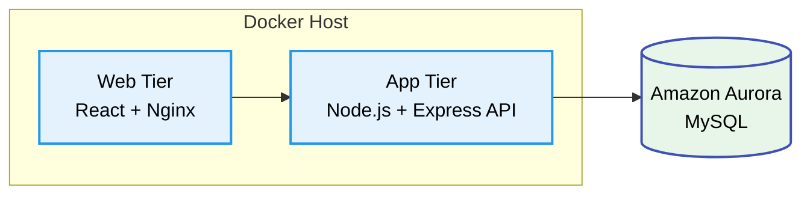
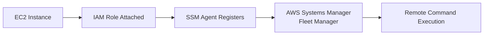
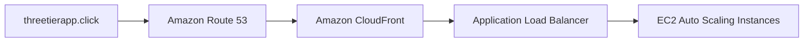
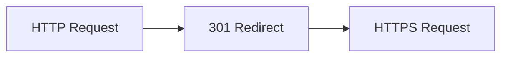
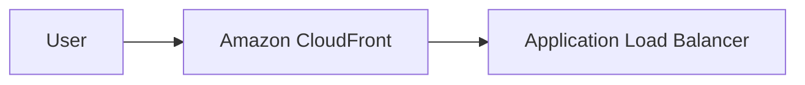
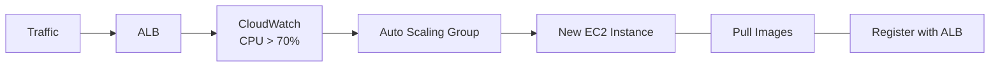

#  3-Tier Web Application Architecture on AWS

A **production-grade, highly available, and containerized 3-tier web application architecture** deployed on **Amazon Web Services (AWS)**.

This project demonstrates modern **Cloud Engineering** and **DevOps** design patterns including:

-  Zero-touch CI/CD deployments
-  Auto-healing compute fleets
-  Zero-Trust network security
-  Global edge acceleration using Amazon CloudFront
-  Centralized monitoring and observability
-  Containerized application deployment
-  High availability with Auto Scaling & Load Balancing


#  Project Overview

The primary objective of this project is to implement a **highly available**, **fault-tolerant**, and **secure** enterprise-grade application delivery platform on AWS.

The architecture follows a **3-tier design pattern**, separating the application into:

##  Presentation Tier
- React Frontend
- Nginx Reverse Proxy
- Static Asset Hosting
- API Reverse Proxy
##  Application Tier
- Node.js
- Express.js
- Business Logic Layer
- REST API

Runs on:

- Docker Containers
- Amazon EC2
- Auto Scaling Group

##  Database Tier
Amazon Aurora MySQL

Features:

- Multi-AZ Deployment
- Private Subnets
- Automatic Failover
- High Availability
- Read Replica Support

This separation improves:

- Scalability
- Security
- Maintainability
- Fault Isolation
- Operational Reliability
---

#  Table of Contents

1. [ Prerequisites & Estimated Costs](#-prerequisites--estimated-costs)
2. [ Project Overview](#-project-overview)
3. [ Architecture Diagram](#️-architecture-diagram)
4. [ Core Infrastructure Setup](#-core-infrastructure-setup)
5. [ IAM Roles & Security Configuration](#-iam-roles--security-configuration)
6. [ EC2 Deployment & Automation](#-ec2-instance-configuration--deployment-automation)
7. [ Amazon ECR Setup](#-amazon-ecr-setup)
8. [ AWS Systems Manager (SSM)](#️-aws-systems-manager-ssm)
9. [ Amazon Aurora Database](#️-amazon-aurora-database-setup)
10. [ CloudFront & Route 53](#-content-delivery-network-cdn--dns-configuration)
11. [ Auto Scaling & Load Balancer](#️-auto-scaling--load-balancing)
12. [ Monitoring & Observability](#-monitoring--observability)
13. [ Troubleshooting Guide](#️-troubleshooting-guide)

---

# Application Stack


[](https://aws.amazon.com/)
[](https://aws.amazon.com/ec2/)
[](https://aws.amazon.com/rds/aurora/)
[](https://aws.amazon.com/cloudfront/)
[](https://aws.amazon.com/route53/)
[](https://aws.amazon.com/cloudwatch/)
[](https://aws.amazon.com/systems-manager/)
[](https://aws.amazon.com/iam/)
[](https://aws.amazon.com/vpc/)
[](https://aws.amazon.com/elasticloadbalancing/)
[](https://aws.amazon.com/autoscaling/)
[](https://aws.amazon.com/codepipeline/)
[](https://aws.amazon.com/ecr/)
[](https://github.com/)
[](https://www.gnu.org/software/bash/)
[](https://aws.amazon.com/cli/)
[](https://aws.amazon.com/rds/aurora/)
[](https://www.docker.com/)
[](https://docs.docker.com/compose/)
[](https://nodejs.org/)
[](https://react.dev/)
[](https://nginx.org/)
[](https://www.mysql.com/)
[](https://git-scm.com/)
---

#  Prerequisites & Estimated Costs

##  Required Tools

- AWS CLI v2.x
- Docker v24+
- Docker Compose v2+
- Git
- Node.js v18+
- npm v9+


##  Zero-Downtime Deployments

Deployments are performed using:

- AWS Systems Manager
- Amazon ECR
- Docker Compose

No SSH keys are required.

<br>

#  Core Infrastructure Setup
###  Key Architectural Pillars


The entire infrastructure resides inside a dedicated VPC.

```
3tierapp-VPC
CIDR:
10.0.0.0/16
```

Availability Zones:

- ap-south-1a
- ap-south-1b

---

## VPC Layout

```text
3tierapp-VPC
│
├── Public Subnet (10.0.1.0/24)
│      Web Tier
│
├── Public Subnet (10.0.2.0/24)
│      Auto Scaling
│
├── Private DB Subnet (10.0.3.0/24)
│
└── Private DB Subnet (10.0.4.0/24)
```

---

## Subnet Architecture

| Subnet | AZ | Type | CIDR | Purpose |
|---------|----|------|------|---------|
| AppTier-public | ap-south-1a | Public | 10.0.1.0/24 | Web Tier |
| AppTier-public-2 | ap-south-1b | Public | 10.0.2.0/24 | Auto Scaling |
| DbTier-private1 | ap-south-1a | Private | 10.0.3.0/24 | Aurora Writer |
| DbTier-private2 | ap-south-1c | Private | 10.0.4.0/24 | Aurora Replica |

<br>

## Security Group Matrix

###   EC2 Instance (Application) Security Group

### Inbound Rules

| Protocol / Port | Purpose | Allowed Source |
|-----------------|---------|----------------|
| **HTTP (80)** | Serves the Nginx/React frontend application | **Application Load Balancer (ALB)** |
| **Custom TCP (4000)** | Handles Node.js backend API requests | **Application Load Balancer (ALB)** |
| **SSH (22)** *(Optional)* | Secure shell access for administration | **Application Load Balancer (ALB)** *(or Admin IP if SSH is enabled)* |

### Outbound Rules

| Protocol | Destination |
|----------|-------------|
| **All Traffic** | `0.0.0.0/0` |

<br>

##  Amazon Aurora Database Security Group

### Inbound Rules

| Protocol / Port | Purpose | Allowed Source |
|-----------------|---------|----------------|
| **MySQL/Aurora (3306)** | Database connections | **EC2 Instance (Application) Security Group ONLY** |

### Outbound Rules

| Protocol | Destination |
|----------|-------------|
| **None** | No outbound traffic allowed (Strictly Isolated) |

<br>

#  IAM Roles & Security Configuration

The entire infrastructure follows the **Principle of Least Privilege (PoLP)** by granting only the permissions required for each AWS service.

Instead of storing long-lived AWS access keys on EC2 instances, the application uses an **IAM Instance Profile** attached directly to the EC2 instances.

This allows secure access to:

- Amazon ECR
- AWS Systems Manager (SSM)
- Amazon CloudWatch

without exposing credentials on disk.


##  EC2 Execution Role

**Role Name**

```text
3Tier-EC2-Execution-Role
```

### Purpose

The EC2 execution role enables application instances to:

- Pull Docker images from Amazon ECR
- Register with AWS Systems Manager
- Publish logs and metrics to Amazon CloudWatch

---

## IAM Policy

```json
{
  "Version": "2012-10-17",
  "Statement": [
    {
      "Effect": "Allow",
      "Action": [
        "ecr:GetAuthorizationToken",
        "ecr:BatchCheckLayerAvailability",
        "ecr:GetDownloadUrlForLayer",
        "ecr:BatchGetImage"
      ],
      "Resource": "*"
    },
    {
      "Effect": "Allow",
      "Action": [
        "ssm:DescribeAssociation",
        "ssm:GetDeployablePatchSnapshotForInstance",
        "ssm:GetDocument",
        "ssm:DescribeDocument",
        "ssm:GetParameters",
        "ssm:ListAssociations",
        "ssm:ListInstanceAssociations",
        "ssm:Messages",
        "ssmmessages:*"
      ],
      "Resource": "*"
    },
    {
      "Effect": "Allow",
      "Action": [
        "cloudwatch:PutMetricData",
        "logs:CreateLogGroup",
        "logs:CreateLogStream",
        "logs:PutLogEvents"
      ],
      "Resource": "*"
    }
  ]
}
```

---

## AWS Managed Policies Attached

- `AmazonSSMManagedInstanceCore`
- `AmazonEC2ContainerRegistryReadOnly`

<br>

#  EC2 Instance Configuration & Deployment Automation

The application runs on a hardened Ubuntu Server with Docker installed.

## Base Instance Specifications

| Component | Configuration |
|-----------|---------------|
| Operating System | Ubuntu Server 22.04 LTS |
| Architecture | x86_64 |
| Base Instance | t3.medium |
| Auto Scaling Instances | t3.micro |
| IAM Role | 3Tier-EC2-Execution-Role |

---
<br>

# Deployment Strategy

Instead of manually connecting via SSH and updating containers, deployments are completely automated.

## Deployment Pipeline


##  CI/CD Deployment Process Flow

This architecture utilizes a fully automated, Zero-Touch deployment pipeline. Below is the step-by-step lifecycle of a code change from the developer's local machine to the live production environment.

**1. Source Control (Push Code)**
The deployment lifecycle begins when a developer commits and pushes code changes to the **GitHub** repository.

**2. Image Build (AWS CodeBuild)**
**AWS CodePipeline** detects the repository change and automatically triggers **AWS CodeBuild**. CodeBuild pulls the latest source code, runs any necessary tests, and builds fresh Docker images for both the Web-Tier and App-Tier.

**3. Image Registry (Amazon ECR)**
Upon a successful build, CodeBuild securely tags and pushes the newly compiled Docker images into **Amazon Elastic Container Registry (ECR)**.

**4. Deployment Trigger (AWS CodeDeploy & SSM)**
With the images safely stored in ECR, CodePipeline moves to the Deploy stage. **AWS CodeDeploy** invokes **Amazon Systems Manager (SSM)** to securely send a deployment command to the target infrastructure, entirely bypassing the need for open SSH ports.

**5. Script Execution (SSM Agent)**
The **SSM Agent**, running quietly on the target **Amazon EC2** instance within the Public Subnet, receives the deployment instruction and executes the server's local `deploy.sh` script.

**6. Image Retrieval (Docker Compose)**
The `deploy.sh` script triggers the local `docker-compose.yml` file. The EC2 instance securely authenticates with **Amazon ECR** using its IAM Role and pulls down the latest Web-Tier and App-Tier Docker images.

**7. Container Orchestration (Spin Up)**
Docker Compose gracefully tears down the outdated containers and immediately spins up the newly pulled containers. The application is now running the latest code.

**8. Database Connectivity (Amazon Aurora)**
The fresh App-Tier container boots up and securely establishes a connection to the **Amazon Aurora Database** residing in the isolated Private Subnet, ready to serve live, dynamic user traffic.
This enables **zero-touch deployments**, reducing operational overhead and improving deployment consistency.

<br>

##  Deployment Automation Script (`deploy.sh`)

The deployment script resides on the EC2 instance and is executed remotely through **AWS Systems Manager Run Command** during the CI/CD pipeline.

```bash
#!/bin/bash

set -e

# Load environment variables
if [ -f .env ]; then
    export $(cat .env | xargs)
fi

echo "Authenticating Docker with Amazon ECR..."

aws ecr get-login-password \
--region ${AWS_REGION} \
| docker login \
--username AWS \
--password-stdin \
${AWS_ACCOUNT_ID}.dkr.ecr.${AWS_REGION}.amazonaws.com

echo "Pulling latest Docker images..."

docker pull ${AWS_ACCOUNT_ID}.dkr.ecr.${AWS_REGION}.amazonaws.com/web-tier-repo:latest

docker pull ${AWS_ACCOUNT_ID}.dkr.ecr.${AWS_REGION}.amazonaws.com/app-tier-repo:latest

echo "Restarting application..."

docker-compose down --remove-orphans

docker-compose up -d

echo "Removing unused Docker images..."

docker image prune -f

echo "Deployment completed successfully."
```
## `deploy.sh` Workflow

The deployment script performs the following tasks:

1. Loads environment variables.
2. Authenticates Docker with Amazon ECR.
3. Pulls the latest application images.
4. Stops the running containers.
5. Deploys updated containers.
6. Removes unused Docker images.
7. Completes deployment without downtime.

<br>

##  Container Orchestration (`docker-compose.yml`)

Application services are orchestrated using Docker Compose.

```yaml
version: "3.8"

services:

  web-tier:
    image: ${AWS_ACCOUNT_ID}.dkr.ecr.${AWS_REGION}.amazonaws.com/web-tier-repo:latest

    container_name: web-tier

    ports:
      - "80:80"

    restart: always

    depends_on:
      - app-tier

    networks:
      - app-network

  app-tier:
    image: ${AWS_ACCOUNT_ID}.dkr.ecr.${AWS_REGION}.amazonaws.com/app-tier-repo:latest

    container_name: app-tier

    ports:
      - "4000:4000"

    restart: always

    environment:
      - DB_HOST=${RDS_ENDPOINT}
      - DB_USER=${DB_USER}
      - DB_PASSWORD=${DB_PASSWORD}
      - DB_NAME=${DB_NAME}

    networks:
      - app-network

networks:

  app-network:
    driver: bridge
```
## Container Architecture



<br>

#  Amazon Elastic Container Registry (ECR)

- Two private repositories are maintained inside Amazon ECR.

| Repository | Purpose |
|------------|---------|
| `web-tier-repo` | React + Nginx container |
| `app-tier-repo` | Node.js backend container |


## Docker Build Workflow

```bash
# Build Web Tier

docker build \
-t web-tier-repo \
./application-code/web-tier

# Build Backend

docker build \
-t app-tier-repo \
./application-code/app-tier
```


## Tag Images

```bash
docker tag web-tier-repo:latest \
168266173985.dkr.ecr.ap-south-1.amazonaws.com/web-tier-repo:latest

docker tag app-tier-repo:latest \
168266173985.dkr.ecr.ap-south-1.amazonaws.com/app-tier-repo:latest
```

## Authenticate Docker with Amazon ECR

```bash
aws ecr get-login-password \
--region ap-south-1 \
| docker login \
--username AWS \
--password-stdin \
168266173985.dkr.ecr.ap-south-1.amazonaws.com
```

## Push Images

```bash
docker push \
168266173985.dkr.ecr.ap-south-1.amazonaws.com/web-tier-repo:latest

docker push \
168266173985.dkr.ecr.ap-south-1.amazonaws.com/app-tier-repo:latest
```

##  Amazon ECR Best Practices

| Feature | Configuration |
|----------|---------------|
| **Image Scanning** |  Scan on Push enabled<br> Vulnerability detection enabled |
| **Image Tag** | `latest` (used for continuous deployment) |
| **Lifecycle Policy** | Automatically deletes untagged images and images older than **14 days** to reduce storage costs and keep the registry clean. |

<br>

#  AWS Systems Manager (SSM)

To enforce a **Zero-Trust management model**, SSH access (`Port 22`) is disabled on all application instances. Administrative access is performed securely through **AWS Systems Manager Session Manager**, eliminating the need for SSH key management.


## Key Benefits

-  No SSH keys required
-  Secure browser-based shell access
-  Session logging and auditing
-  Remote command execution
-  Patch management and automation


## SSM Agent

Ubuntu Server 22.04 includes the SSM Agent, which can be verified using:

```bash
sudo systemctl status snap.amazon-ssm-agent.amazon-ssm-agent.service
```

---

## Fleet Registration

After attaching the **AmazonSSMManagedInstanceCore** IAM policy, EC2 instances automatically register with Systems Manager and appear as **Online** in Fleet Manager.

Deployment workflow:



<br>

#  Amazon Aurora Database Setup

The database layer is powered by **Amazon Aurora MySQL-Compatible Edition**, providing high availability, automatic failover, and Multi-AZ replication.


## Cluster Configuration

| Property | Value |
|----------|-------|
| Engine | Amazon Aurora MySQL 8.0 |
| Cluster Name | `threetierdb-cluster` |
| Deployment | Multi-AZ |
| Writer | ap-south-1a |
| Reader | ap-south-1c |
| Database Class | db.t3.medium / db.r6g.large |
| Public Access | Disabled |


## Database Security

The Aurora cluster resides entirely inside **private subnets**.


Or, if you want the cross to stand alone between them:


```text
 Internet  ─── X ───>   Application Server  ─────────>   Amazon Aurora
````
Only the **Application Security Group** is allowed to communicate with the database over **TCP 3306**.


## Database Connectivity

Application containers receive database credentials through environment variables.

```javascript
module.exports = {
    host: process.env.DB_HOST,
    user: process.env.DB_USER,
    password: process.env.DB_PASSWORD,
    database: process.env.DB_NAME,
    port: 3306
};
```

This avoids hardcoding credentials into the application.

<br>

#  DNS & Content Delivery Network (CDN)  Configuration

To reduce latency and improve global performance, the application uses **Amazon CloudFront** as a Content Delivery Network.


##   Amazon Route 53

Amazon Route 53 provides highly available DNS routing by resolving your custom domain to the CloudFront distribution. It integrates with **AWS Certificate Manager (ACM)** for SSL/TLS validation, ensuring secure HTTPS access to the application.

### DNS Flow




##   CloudFront Configuration  

| Setting | Configuration |
|----------|---------------|
| **Origin** | Application Load Balancer |
| **Example Origin** | `3tier-alb-12345.ap-south-1.elb.amazonaws.com` |
| **Default Route (`*`)** | Cache **GET** & **HEAD** requests, forward required headers |
| **API Route (`/api/*`)** | **Caching Disabled** (`TTL = 0`), allows **GET, POST, PUT, DELETE, OPTIONS**, forwards query strings & cookies |
| **Viewer Policy** | Redirect **HTTP → HTTPS** |

###  Viewer Protocol Flow



> All users accessing the application over **HTTP** are automatically redirected to **HTTPS**.

---

###  Request Flow




<br>

#  Auto Scaling & Load Balancing
 

The application automatically adjusts compute capacity using an **Application Load Balancer** and an **Auto Scaling Group**.
##  Launch Template

Auto Scaling instances are launched using a reusable Launch Template.

Configuration:

- Ubuntu Server
- Docker Installed
- IAM Role Attached
- User Data Script
- Detailed Monitoring Enabled


## Application Load Balancer

### Listeners

| Port | Purpose |
|------|---------|
| 80 | HTTP |
| 443 | HTTPS |


###  Target Group Configuration
---
| Setting | Value |
|---------|-------|
| **Target Group** | `3tier-app-tg` |
| **Health Check Path** | `/` or `/health` |
| **Health Check Interval** | `30 Seconds` |
| **Healthy Threshold** | `2 Successful Checks` |

<br>

#  Auto Scaling Group (ASG)

Amazon EC2 Auto Scaling automatically adjusts the number of EC2 instances based on application demand, ensuring high availability while optimizing infrastructure costs. Instances are distributed across multiple Availability Zones to improve fault tolerance and resiliency.

###  Configuration

| Property | Value |
|----------|-------|
| **Minimum Capacity** | 1 |
| **Desired Capacity** | 1 |
| **Maximum Capacity** | 4 |

---

###  Scaling Policy

| Metric | Scale Out | Action | Cooldown |
|--------|-----------|--------|----------|
| **CPUUtilization** | **CPU > 70%** | **+1 EC2 Instance** | **300 Seconds** |


##  Scaling Workflow


---
<br>

#  Monitoring & Observability

Amazon CloudWatch provides centralized monitoring by collecting real-time metrics, logs, and alarms across the application, load balancer, and database, enabling proactive performance analysis and rapid issue detection.


##   CloudWatch Dashboard


###  Compute Layer

- **CPU Utilization:** Monitors EC2 processor usage to identify high workload conditions.
- **Network In:** Tracks incoming network traffic received by the instance.
- **Network Out:** Measures outbound network traffic sent from the instance.
- **Disk Usage:** Monitors disk space consumption and storage health.

---

###  Application Load Balancer

- **Request Count:** Displays the total number of client requests processed.
- **Response Time:** Measures the average time taken to serve client requests.
- **HTTP 5XX Errors:** Tracks server-side failures returned by backend targets.
- **Healthy Targets:** Indicates the number of healthy EC2 instances available to receive traffic.

---

###  Amazon Aurora Database

- **Database Connections:** Monitors active client connections to the database.
- **CPU Utilization:** Tracks database compute usage under workload.
- **Select Latency:** Measures the average execution time of read (SELECT) queries.
- **Insert Latency:** Measures the average execution time of write (INSERT) operations.
---

##  CloudWatch Alarms

CloudWatch Alarms continuously monitor key infrastructure metrics and automatically trigger scaling actions or notifications when predefined thresholds are exceeded.

| Alarm | Trigger Condition | Evaluation Period | Action |
|-------|-------------------|-------------------|--------|
| ** High CPU Alarm** | **CPU Utilization > 70%** | **1 Minute** | Scale out the Auto Scaling Group by launching a new EC2 instance. |
| ** Aurora Connection Alarm** | **Database Connections > 80%** | Continuous Monitoring | Send a CloudWatch notification for administrator intervention. |

<br>


#  Future Scope

This project establishes a production-ready AWS 3-tier architecture and can be extended with additional cloud-native capabilities to improve scalability, security, and operational efficiency.

- **Infrastructure as Code (IaC):** Provision the complete infrastructure using Terraform or AWS CloudFormation.
- **Container Orchestration:** Migrate the application from Docker Compose to Amazon ECS or Amazon EKS.
- **Blue/Green Deployments:** Implement zero-downtime deployments using AWS CodeDeploy.
- **Web Application Firewall:** Integrate AWS WAF and AWS Shield for enhanced application security.
- **Secrets Management:** Replace environment variables with AWS Secrets Manager or Parameter Store.
- **Centralized Logging:** Aggregate application logs using Amazon CloudWatch Logs and OpenSearch.
- **Observability:** Add distributed tracing with AWS X-Ray and build advanced CloudWatch dashboards.
- **Multi-Region Deployment:** Deploy across multiple AWS Regions using Route 53 failover routing for disaster recovery.
- **Automated Backups:** Enable Aurora automated backups and cross-region snapshots.
- **GitOps Workflow:** Adopt Argo CD or Flux for Kubernetes-based continuous deployment.
